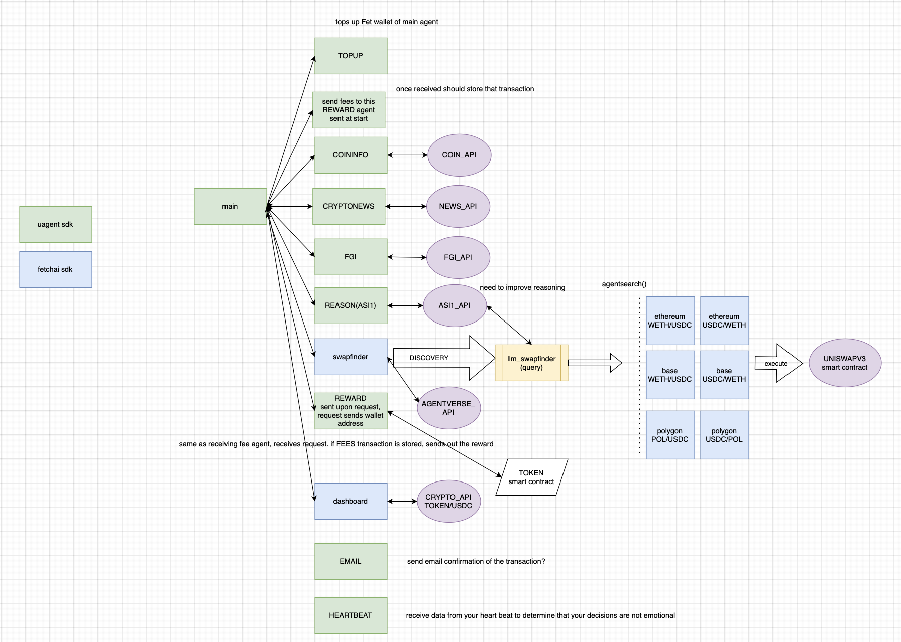

# CryptoFund: Autonomous Crypto Trading Platform
## Leveraging Fetch.ai's Multi-Agent Framework

---

## Project Overview

CryptoFund is a decentralized autonomous crypto trading assistant built using Fetch.ai's agent framework and uAgents. Our system leverages multiple specialized AI agents that collaborate to analyze market data, sentiment indicators, and financial data to make informed cryptocurrency trading decisions.

---

## Core Technologies

- **Fetch.ai uAgents (v0.9.4)**: Foundation of our multi-agent architecture
- **uAgents-core (v0.2.0)**: Core libraries for agent operations
- **Fetch.ai Registration**: Agent discovery via Agentverse
- **CosmPy**: For Fetch.ai blockchain interactions
- **Web3.py**: For Ethereum/Base network transactions
- **ASI1 Mini LLM**: Advanced reasoning for trading decisions

---

## System Architecture



---

## Agent Architecture Details

### Main Orchestrator Agent
```python
# From cryptoreason/main_agent.py
from uagents import Context
from cryptoreason.common.base_agent import BaseAgent
# ... imports ...

# Agent communication model examples
from cryptoreason.common.models import (
    Heartbeat, CoinRequest, CoinResponse, 
    CryptonewsRequest, CryptonewsResponse,
    FGIRequest, FGIResponse, ASI1Request, 
    ASI1Response, SwaplandRequest, SwaplandResponse
)
```

- Central coordinator for all system operations
- Built on the Fetch.ai uAgents framework
- Manages communication and workflow between all agents

---

## Data Collection Agents

### CoinInfo Agent
- Fetches real-time cryptocurrency market data
- Uses uAgents for structured data communication
- Transparent data sourcing from CoinGecko API

### News & Sentiment Agents
- CryptoNews Agent: Monitors news sources
- FGI Agent: Tracks market sentiment via Fear & Greed Index
- Heartbeat Agent: Monitors emotional states via heart rate

---

## Decision-Making Layer

### ASI1 Reason Agent
```python
# Fetch.ai agent integration for LLM reasoning
from uagents import Agent, Context, Model
from uagents.setup import fund_agent_if_low
```

- Powered by ASI1 Mini LLM
- Analyzes data from collection agents
- Generates trading signals based on market analysis
- Leverages uAgents for structured communication

---

## Transaction Layer

### SwapFinder Agent
```python
# From cryptoreason/swapland/swapfinder.py
from uagents_core.identity import Identity
from fetchai.registration import register_with_agentverse
from fetchai.communication import parse_message_from_agent, send_message_to_agent
from uagents import Model
```

- Uses Fetch.ai's Agentverse for agent discovery
- Dynamically discovers available swap execution agents
- Matches trading signals to appropriate execution agents

### Swap Execution Agents
- Integrated with Uniswap V3 on Base network
- Executes trades automatically based on signals
- Secure transaction handling with Web3.py

---

## Financial Support Agents

### Topup Agent
```python
# From cryptoreason/topup_agent.py
from uagents import Agent, Context, Protocol, Model, Field
from uagents.agent import AgentRepresentation
from uagents.setup import fund_agent_if_low
```

- Manages wallet funding
- Utilizes Fetch.ai's wallet integration
- Handles agent funding operations

### Reward Agent
```python
# From cryptoreason/reward_agent.py
from uagents import Agent, Context, Model
from uagents.network import wait_for_tx_to_complete
from uagents.setup import fund_agent_if_low
```

- Processes payments and rewards
- Uses Fetch.ai's secure transaction system
- Handles TESTFET token distributions

---

## Key Fetch.ai Components Used

1. **uAgents Framework**
   - Agent creation and lifecycle management
   - Secure identity handling
   - Structured message passing

2. **Agent Communication Protocol**
   - Type-safe message models
   - Asynchronous message handling
   - Reliable delivery mechanisms

3. **Agentverse Integration**
   - Agent registration and discovery
   - Secure communication channels
   - Dynamic service location

4. **Blockchain Integration**
   - Native FET token support
   - Secure wallet management
   - Transaction verification

---

## Implementation Highlights

### Base Agent Class
```python
# From cryptoreason/common/base_agent.py
class BaseAgent:
    def __init__(self, name: str, port: int, seed: str, endpoints: Optional[List[str]] = None):
        # Configure endpoints
        if not endpoints:
            endpoints = [f"http://127.0.0.1:{port}/submit"]
            
        # Create the agent using Fetch.ai uAgents
        self.agent = Agent(
            name=name,
            port=port,
            seed=seed,
            endpoint=endpoints
        )
```

---

## Secure Agent Communication

### Message Models
```python
# Example message models using uAgents Model class
class CoinRequest(Model):
    blockchain: str

class CoinResponse(Model):
    name: str
    symbol: str
    current_price: float
    market_cap: float
    total_volume: float
    price_change_24h: float
```

- Type-safe message validation
- Structured data exchange
- Transparent inter-agent communication

---

## User Interaction

### API Server
- REST API for external system integration
- Real-time data access
- Command interface for trading operations

### Heart Rate Monitoring
- Emotional safeguards for trading decisions
- prevents panic selling and FOMO buying
- Integrated with Fetch.ai agent system

---

## Advanced Features

### Dynamic Agent Discovery
- SwapFinder agent discovers execution agents via Agentverse
- System adapts to available services
- Resilient to agent failures

### Multi-layer Decision Making
1. Data collection from multiple sources
2. Data preparation and normalization
3. AI-powered analysis by ASI1 reasoning model
4. Decision execution through appropriate swap agents

---

## Benefits of Fetch.ai Integration

1. **Agent Autonomy**: Independent agents with specialized roles
2. **Secure Communication**: Encrypted, reliable message passing
3. **Distributed Architecture**: Resilient to failures
4. **Blockchain Integration**: Native crypto transaction support
5. **Discovery Mechanism**: Dynamic service location

---

## Conclusion

CryptoFund demonstrates the power of Fetch.ai's uAgents framework for building complex, distributed systems with:

- **Multiple Specialized Agents**: Working together autonomously
- **Secure Communication**: Via Fetch.ai's agent messaging
- **AI-Powered Decisions**: Enhanced by structured agent data
- **Blockchain Integration**: For secure financial transactions
- **Dynamic Discovery**: For resilient system operations

---

## Future Development

1. **Advanced Agent Protocols**: Enhanced communication patterns
2. **Cross-chain Support**: Additional blockchain integrations
3. **AI Model Improvements**: More sophisticated decision models
4. **Mobile Integration**: User-friendly mobile interfaces
5. **Agent Marketplace**: Extensible agent ecosystem 